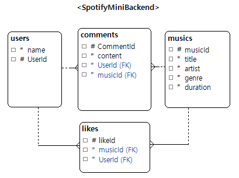

# 🎵 SpotifyMiniBackend

> Jakarta Servlet 기반으로 구현한 Spotify Mini 클론 백엔드 프로젝트

---

## 📌 프로젝트 소개

SpotifyMiniBackend는 Spotify의 핵심 기능을 간소화하여 구현한 백엔드 서버입니다.  
Spring 없이 순수 **Jakarta Servlet**과 **JDBC**를 활용하여 REST API를 직접 설계·구현하였습니다.  
팀원 각자가 기능을 분담하여 협업하며 백엔드 핵심 개념을 학습하는 것을 목표로 합니다.

---

## 👥 팀원

| 이름  | 역할             |
|-----|----------------|
| 정해원 | 곡 목록/상세 조회, 댓글 조회/등록 |
| 남채린 | 좋아요 조회/등록/삭제   |

---

## 🛠️ 기술 스택

| 구분 | 기술                                  |
|------|-------------------------------------|
| Language | Java 21                             |
| Server | Jakarta Servlet API 6.1.0           |
| Build Tool | Gradle                              |
| Database | MySQL                               |
| JSON 파싱 | Jackson Databind 3.1.2, Gson 2.11.0 |

---

## ✨ 주요 기능

### 🎵 곡 조회 / 검색
- 전체 곡 목록 조회
- 키워드 기반 곡 검색
- 곡 상세 정보

### ✍️ 댓글 조회 / 등록
- 각 곡에 달린 댓글 조회
- 댓글 등록

### ❤️ 좋아요 기능
- 곡 좋아요 등록 및 취소
- 찜한 곡 목록 조회

---

## 🏗️ 아키텍처

Spring 없이 순수 Servlet으로 레이어를 직접 분리하여 구현하였습니다.  
기능에 따라 Controller 레이어를 두거나 Servlet에서 직접 Service를 호출하는 방식으로 구현하였습니다.

```
[ Client ]
    ↓ HTTP Request
[ Servlet ]           # 요청 수신, 응답 반환 (진입점)
    ↓
[ Controller ]        # 요청 파싱, 비즈니스 로직 호출 (선택적 적용)
    ↓ (또는 Servlet에서 직접 호출)
[ Service ]           # 비즈니스 로직 처리
    ↓
[ DAO ]               # DB 쿼리 실행 (JDBCTemplate 활용)
    ↓
[ MySQL DB ]
```
---

## 📁 프로젝트 구조

```
SpotifyMiniBackend/
├── src/
│   └── main/
│       ├── java/
│       │   └── com/ohgiraffers/api/
│       │       ├── comment/                # 댓글 기능
│       │       │   ├── CommentApiServlet
│       │       │   ├── CommentDAO
│       │       │   ├── CommentDTO
│       │       │   └── CommentService
│       │       ├── likes/                  # 좋아요/찜 기능
│       │       │   ├── dto/
│       │       │   ├── LikeController
│       │       │   ├── LikeDAO
│       │       │   ├── LikeService
│       │       │   └── LikeServlet
│       │       ├── music/                  # 음악 조회 기능
│       │       │   ├── MusicApiServlet
│       │       │   ├── MusicDAO
│       │       │   ├── MusicDTO
│       │       │   └── MusicService
│       │       ├── common/                 # 공통 유틸리티
│       │       │   └── JDBCTemplate        # DB 연결 관리
│       │       └── ErrorResponse           # 공통 에러 응답
│       ├── resources/
│       │   ├── mapper/                     # SQL 매퍼
│       │   ├── db.properties               # DB 연결 정보 (gitignore)
│       │   └── schema.sql                  # 테이블 생성 DDL
│       └── webapp/
│           ├── WEB-INF/
│           └── index.jsp
├── build.gradle
├── settings.gradle
└── 데이터모델.damx                          # DB 설계 파일
```
---
## 🗄️ ERD


---
## 📡 API 명세

### Music

| Method | URI            | 설명         |
|--------|----------------|------------|
| GET | `/musics`      | 전체 곡 목록 조회 |
| GET | `/musics/{id}` | 곡 상세 조회    |

### Comment (댓글)

| Method | URI | 설명 |
|--------|-----|------|
| POST | `/comments` | 댓글 등록 |
| GET | `/comments?userId={userID}&musicId={musicId}` | 댓글 목록 조회 |

**Query Parameters**

| 파라미터   | 타입 | 필수 | 설명      |
|--------|------|------|---------|
| userId | int | ✅ | user id |
| musicId | int | ✅ | music id |
| content | String | ✅ | 댓글 내용 |

**POST Request Body**
```json
{
   "userId":1,
   "musicId":15,
   "content":"이 노래 내 스타일"
}
```

### Like (좋아요)

| Method | URI                          | 설명           |
|--------|------------------------------|--------------|
| POST | `/favorites`                 | 좋아요 등록       |
| DELETE | `/favorites?likeId={likeId}` | 좋아요 취소       |
| GET | `/favorites?userId={userId}` | 좋아요한 곡 목록 조회 |

**Query Parameters**

| 파라미터   | 타입 | 필수 | 설명      |
|--------|------|------|---------|
| userId | int | ✅ | user id |
| likeId | int | ✅ | like id |

**POST Request Body**
```json
{
  "userId": 1,
  "musicId": 12
}
```

---

## 🗄️ 데이터베이스 설계
**주요 테이블**

| 테이블명       | 설명        |
|------------|-----------|
| `users`    | 유저 정보     |
| `musics`   | 곡 정보      |
| `comments` | 댓글 정보     |
| `likes`    | 곡/사용자별 좋아요 정보 |

---

## ⚙️ 환경 설정 및 실행 방법

### 1. 저장소 클론

```bash
git clone https://github.com/songpa-backend/SpotifyMiniBackend.git
cd SpotifyMiniBackend
```

### 2. 데이터베이스 설정

MySQL에서 데이터베이스를 생성합니다.

```sql
CREATE DATABASE spotifymini_db;
```

이후 `schema.sql` 파일을 실행하여 테이블을 생성합니다.

```bash
mysql -u your_username -p spotifymini_db < schema.sql
```

### 3. db.properties 파일 생성

프로젝트 루트에 `db.properties` 파일을 직접 생성해야 합니다.  
(보안상 `.gitignore`에 등록되어 있어 저장소에 포함되지 않습니다.)

```properties
driver=com.mysql.jdbc.Driver
url=jdbc:mysql://localhost:3306/spotifymini_db
user=your_username
password=your_password
```

### 4. 빌드 및 실행

```bash
./gradlew build
```

빌드 후 생성된 `.war` 파일을 **Apache Tomcat**에 배포합니다.

```
build/libs/SpotifyMiniBackend-1.0-SNAPSHOT.war
```
 

---

## 🚨 트러블슈팅

### 좋아요 등록 후 하트 아이콘이 즉시 반영되지 않는 문제

**문제 상황**  
곡 전체 목록 페이지에서 좋아요 등록 시 빈 하트가 채워진 하트로 즉시 변경되어야 하는데,  
새로고침을 해야만 반영되는 문제가 발생하였습니다.  
좋아요 **해제**는 즉시 반영되는 반면, **등록**만 새로고침이 필요한 상황이었습니다.

**원인**  
좋아요 등록 API의 응답에 `userId`와 `musicId`가 포함되지 않아,  
프론트엔드가 방금 등록된 좋아요가 현재 사용자의 것인지 식별하지 못하고 UI를 업데이트하지 않았습니다.

좋아요 해제의 경우, 이미 화면에 렌더링된 데이터에 `userId`와 `musicId`가 존재하는 상태에서 요청이 이루어지기 때문에 응답 없이도 즉시 UI 변경이 가능했습니다.

반면 등록의 경우, 성공 응답에 해당 정보가 없으니 프론트엔드가 성공 여부를 판단하지 못하고 UI를 그대로 유지했고, 새로고침 시 목록 조회 API를 다시 호출하면서 그때서야 반영되었습니다.

**해결 방법**  
좋아요 등록 API의 응답 body에 `userId`와 `musicId`를 포함하도록 수정하였습니다.

```json
{
  "likeId": 45,
  "userId": 1,
  "musicId": 12
}
```

### 댓글 목록 렌더링 시 발생하는 리액트 unique key prop 에러
**문제 상황**  
- 프론트엔드(React/Next.js) 화면에서 댓글 목록을 렌더링할 때, **콘솔창에 고유한 key 값이 없다는 에러(Each child in a list should have a unique "key" prop)** 가 발생하였습니다.
- 프론트엔드 코드 상태:
프론트엔드에서는 반복문(map)을 돌며 각 댓글의 고유 ID를 key로 지정하기 위해 아래와 같이 코드를 작성해 둔 상태 입니다.
```
<div key={comment.id} className={styles.commentLine}>
```

**원인**  
- **백엔드 자바 DTO와 프론트엔드가 기대하는 JSON Key 이름의 불일치 하여 발생하였습니다.**
- 상세 분석:
    - 기존 자바 CommentDTO에는 댓글 고유 번호 변수명이 private int comment_id;로 정의되어 있었습니다.
    - 이에 따라 백엔드가 JSON 데이터를 보낼 때 "comment_id": 1 이라는 이름표로 데이터를 전송하였습니다.
    - 하지만 프론트엔드는 comment.id 즉, "id"라는 이름표를 찾고 있었기 때문에 comment.id 값이 undefined로 인식되어 리액트 key 에러가 발생 하였습니다.

**해결 방법**  
- 해결: 자바 DTO에 프론트엔드 요구사항에 맞춘 getId() Getter 메서드를 추가하여 JSON 이름표를 동적으로 생성하였습니다.
- 백엔드 수정 코드
```
    public int getId() {
        return this.comment_id;
    }

    public int getComment_id() {
        return comment_id;
    }
```
**배운 점**
- 자바 객체가 JSON으로 변환될 때 변수명이 아니라 Getter 메서드의 이름을 기준으로 프로퍼티(Key)가 생성된다는 점을 깊이 이해하게 됨.
---

## 📝 개발 환경

- **IDE**: IntelliJ IDEA
- **Java**: JDK 21
- **WAS**: Apache Tomcat 11.0.22 (Jakarta EE 호환)
- **DB Tool**: MySQL Workbench
